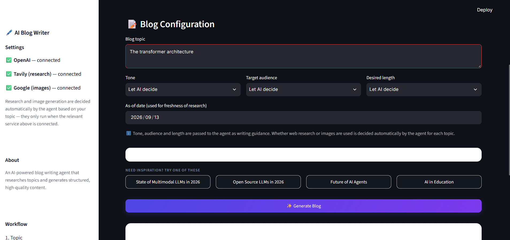
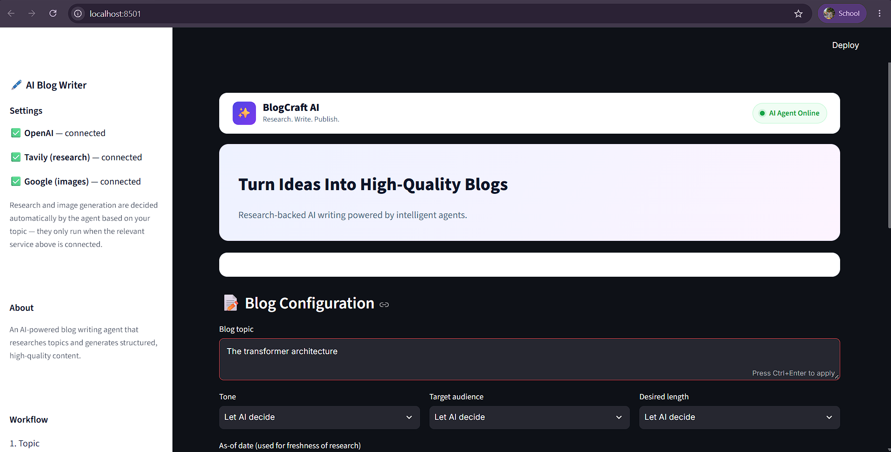
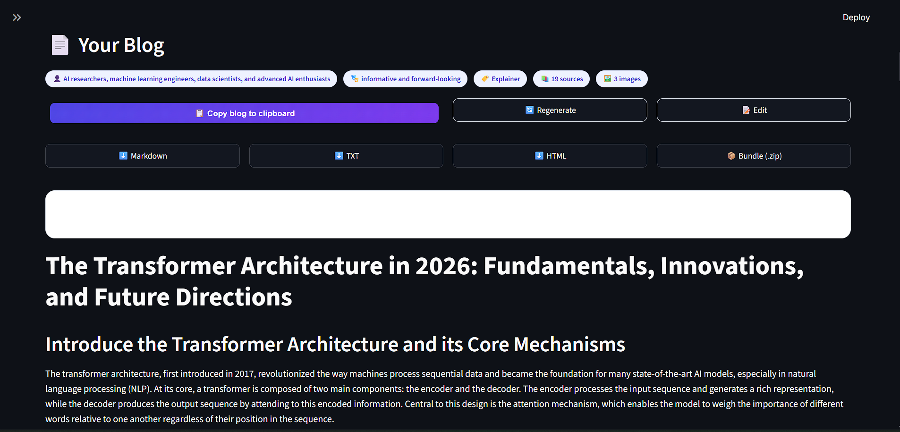

# ✨ BlogCraft AI

**Research. Write. Publish.**

An AI-powered blog writing agent built on **LangGraph** and **LangChain** that researches a topic, plans a structured outline, writes it section by section, and (optionally) generates supporting images — all wrapped in a polished, production-style **Streamlit** interface.

<p align="center">
  
</p>

---

## 🧠 How It Works

BlogCraft AI is powered by a multi-agent workflow built with **LangGraph**:

```
Topic
  │
  ▼
Router ──► decides if web research is needed (closed_book / hybrid / open_book)
  │
  ├──► Research (Tavily) ──► gathers and filters up-to-date evidence
  │
  ▼
Orchestrator ──► plans a structured outline (sections, goals, word targets)
  │
  ▼
Workers (parallel) ──► write each section, citing evidence where required
  │
  ▼
Reducer
  ├── merge_content        → combines sections into one draft
  ├── decide_images         → decides if diagrams/images would help (max 3)
  └── generate_and_place    → generates images (Gemini) and embeds them
  │
  ▼
Final Blog (Markdown + images)
```

Every decision — whether to research, what tone to use, whether images are needed — is made autonomously by the agent based on the topic. The frontend surfaces those decisions transparently rather than pretending to control things the backend doesn't expose.

---

## 🖥️ Features

- **Modern SaaS-style UI** — clean, card-based layout inspired by tools like Notion AI and Perplexity
- **Live agent status** — see exactly which stage the agent is on (analyzing, researching, writing, polishing)
- **Configurable writing guidance** — tone, target audience, and desired length hints for the agent
- **Professional reading layout** — the generated blog renders like a real article, not a text dump
- **Source citations** — every piece of research evidence is listed and linkable
- **Inline images** — AI-generated diagrams are embedded directly in the article
- **Export options** — download as Markdown, TXT, HTML, or a full `.zip` bundle (article + images)
- **One-click clipboard copy**
- **Inline editing** — tweak the generated article before exporting
- **Regenerate** without re-entering your topic
- **Past blogs library** — reload any previously generated article from the sidebar
- **Service status indicators** — see which API keys are configured, without ever exposing the keys themselves

---

## 📸 Screenshots

| Configuration | Generation | Final Article |
|---|---|---|
|  |  |  |

---

## 🏗️ Tech Stack

| Layer | Technology |
|---|---|
| Orchestration | [LangGraph](https://github.com/langchain-ai/langgraph) |
| LLM Framework | [LangChain](https://github.com/langchain-ai/langchain) |
| Language Model | OpenAI (`gpt-4.1-mini`) |
| Web Research | [Tavily Search API](https://tavily.com/) |
| Image Generation | Google Gemini (`gemini-2.5-flash-image`) |
| Frontend | [Streamlit](https://streamlit.io/) |
| Validation | Pydantic |

---

## 📂 Project Structure

```
.
├── bwa_backend.py         # LangGraph agent: router, research, planner, writers, image pipeline
├── bwa_frontend.py        # Streamlit UI
├── .streamlit/
│   └── config.toml        # Enforces the app's light theme
├── requirements.txt
├── images/                # Generated images (created automatically at runtime)
└── assets/
    └── screenshots/       # README screenshots
```

---

## ⚙️ Setup

### 1. Clone the repository

```bash
git clone https://github.com/<your-username>/blogcraft-ai.git
cd blogcraft-ai
```

### 2. Create a virtual environment and install dependencies

```bash
python -m venv venv
source venv/bin/activate   # Windows: venv\Scripts\activate
pip install -r requirements.txt
```

### 3. Configure environment variables

Create a `.env` file in the project root:

```env
OPENAI_API_KEY=your_openai_api_key
TAVILY_API_KEY=your_tavily_api_key
GOOGLE_API_KEY=your_google_api_key
```

| Variable | Required | Purpose |
|---|---|---|
| `OPENAI_API_KEY` | ✅ Yes | Powers planning, writing, and routing |
| `TAVILY_API_KEY` | Optional | Enables web research for time-sensitive topics |
| `GOOGLE_API_KEY` | Optional | Enables image generation for the article |

The app runs without Tavily or Google configured — it simply skips research/images for that run and shows their status as "not configured" in the sidebar.

### 4. Run the app

```bash
streamlit run bwa_frontend.py
```

Then open **http://localhost:8501** in your browser.

---

## 🧩 Usage

1. Enter a blog topic (or click one of the example topics).
2. Optionally set a tone, target audience, and desired length as guidance for the AI.
3. Click **✨ Generate Blog** and watch the live progress as the agent researches, plans, and writes.
4. Review the finished article, check its sources, and edit it inline if needed.
5. Export it as Markdown, TXT, HTML, or a full `.zip` bundle — or copy it straight to your clipboard.

---

## 🗺️ Roadmap

- [ ] Multi-language blog generation
- [ ] Custom outline editing before writing begins
- [ ] Pluggable LLM providers (Anthropic, local models)
- [ ] Scheduled/batch blog generation

---

## 🤝 Contributing

Contributions are welcome! Please open an issue to discuss what you'd like to change before submitting a pull request.

---

## 📄 License

This project is licensed under the MIT License — see the [LICENSE](LICENSE) file for details.

---

<p align="center">Built with Streamlit • LangGraph • LangChain • AI</p>